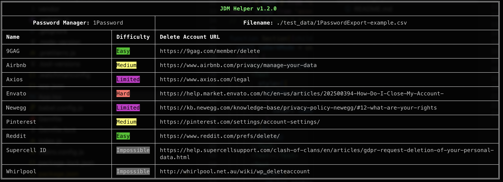

# jdm-helper

A CLI tool to help identify which sites on https://justdeleteme.xyz/ you have accounts on via your password manager of choice and helps you delete your account on it.



## Dependencies
- Node >=v16

## Usage

```bash
npx jdm-helper [path_to_password_file]

// Example:
npx jdm-helper ./my-exported-password-file.csv
```

## Supported Password Managers
- **1Password**: CSV file
To export 1Password vaults: https://support.1password.com/export/

## TODO
- [ ] Add support for Chrome Password Manager
- [ ] Add support for Bitwarden
- [ ] Add support for iCloud Keychain
- [ ] Add tests
- [ ] Add CI (tests & deploy)